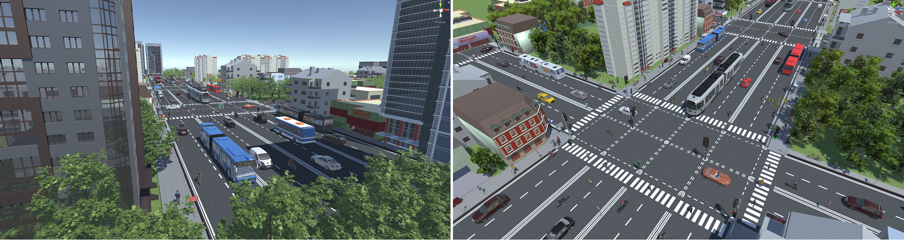

# VEIS
[Effective Use of Synthetic Data for Urban Scene Semantic Segmentation](http://openaccess.thecvf.com/content_ECCV_2018/papers/Fatemeh_Sadat_Saleh_Effective_Use_of_ECCV_2018_paper.pdf)

## Description

This dataset contains synthetic images which are obtained from an environment created in the Unity3D framework, called VEIS (Virtual Environment for Instance Segmentation).
we used the Unity3D game engine, in which one can manually design scenes with common urban structures and add freely-available 3D objects, representing foreground classes, to the scene.
Having access to the source code and manually constructing the scenes both facilitate generating annotations such as instance-level pixel-wise labels automatically. Specifically, before starting to generate the frames, our framework counts the number of instances of each class, and then assigns a unique ID to each instance. These unique IDs then automatically create unique textures and shaders for their corresponding instances. When data generation starts, both the original textures and shaders and the automatically created ones are rendered, thus allowing us to capture the synthetic image and the instance-level semantic segmentation map at the same time and in real time. Creating VEIS took 1 day to 1 person. This is very little effort, considering that VEIS allows us to have access to a virtually unlimited number of annotated images with the object classes of standard real urban scene datasets, such as CamVid and CityScapes.
As can be seen from the samples in the dataset, the images generated by VEIS look less photo-realistic than those of GTA game. Therefore, as evidenced by our experiments, using them to train a semantic segmentation network does not
significantly help improve accuracy on real images compared to using existing synthetic datasets. However, using these images within our proposed detection based framework allows us to significantly improve semantic segmentation quality.
This is due to the fact that, while not realistic in texture, the foreground objects generated by VEIS are realistic in shape, and our environment allowed us to cover a wide range of shape and pose variations.

## Download
You can download the RGB images of the dataset here:

[Part1](https://drive.google.com/file/d/1S2NgEEdV51vopU_33x_8mTx_D03X3Y-e/view?usp=sharing)

[Part2](https://drive.google.com/file/d/1h-PqddcVCeyQ-iccwDog6zMXzbuwDOvp/view?usp=sharing)

[Part3](https://drive.google.com/file/d/1R7lnkf1qk9NOskZf_hXJY6YKeVgW1ZLV/view?usp=sharing)

Please note you need to download all parts in the same directory to be able to extract them.

You can also download pixel-level annotation and instance-level annotation here:

[pixel-level annotation](https://drive.google.com/file/d/1AWKETfGribuX6lB_msvaQBA6cyU6wbX3/view?usp=sharing)

[instance-level annotation](https://drive.google.com/file/d/1K1CBkilDQFJX0uNkazEK5RTZ8EOXG4lh/view?usp=sharing)
## Dataset Details
The dataset contains 61305 images. 


You have access to the information according to the instance-level segmentation for the 10 foreground classes (traffic light, traffic sign, person, rider, car, truck, bus, train, motorcycle, and bicycle) in a COCO json format file, [VEIS_train_annotation.json](https://drive.google.com/file/d/1K1CBkilDQFJX0uNkazEK5RTZ8EOXG4lh/view?usp=sharing), containing "images", "annotations", and "categories".
You can use the bellow python code to visualize the annotation of one segment:

```

import cv2
import numpy as np
from matplotlib import pyplot as plt
import json

data_veis = json.load(open("VEIS_train_annotation.json",'rb'))

segment_id = 65375 
img= np.zeros((600,800,3))

contours = []
length = len(data_veis['annotations'][segment_id]['segmentation'])
for i in range(length):
    id = 0
    contour = data_veis['annotations'][segment_id]['segmentation'][i]
    cnt = len(contour)
    c = np.zeros((cnt/2,1,2),dtype=np.int32)
    for j in range(0,cnt,2):
        c[id,0,0] = contour[j]
        c[id,0,1] = contour[j+1]
        id = id + 1
    contours.append(c)


cv2.drawContours(img, contours, -1, 255, -1)

plt.imshow(img)
plt.show()


```

You also have access to the pixel-level annotation for a part of the images in [VEIS_pixel.zip](https://drive.google.com/file/d/1AWKETfGribuX6lB_msvaQBA6cyU6wbX3/view?usp=sharing). This provides the annotation for semantic segmentation task.
These are the class ids for each category containing both background classes and foreground classes in the pixel-level annotation:
```
road: 0
sidewalk: 1
building: 2
wall: 3
fence: 4
pole: 5
traffic light: 6
traffic sign: 7
vegetation: 8
terrain: 9
sky: 10
person: 11
rider: 12
car: 13
truck: 14
bus: 15
train: 16
motorcycle: 17
bicycle: 18
```


---
## Citation
If you are using our dataset, please cite
```
@inproceedings{sadat2018effective,
  title={Effective Use of Synthetic Data for Urban Scene Semantic Segmentation},
  author={Sadat Saleh, Fatemeh and Sadegh Aliakbarian, Mohammad and Salzmann, Mathieu and Petersson, Lars and Alvarez, Jose M},
  booktitle={Proceedings of the European Conference on Computer Vision (ECCV)},
  pages={84--100},
  year={2018}
}
```

---
## Contact
For any question, bug report, and etc., please contact Fatemeh Saleh via fatemehsadat.saleh@anu.edu.au
